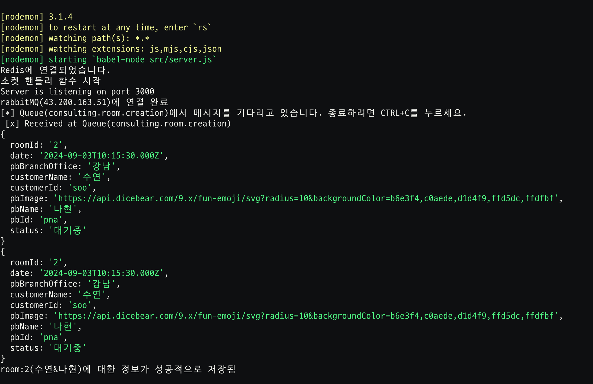
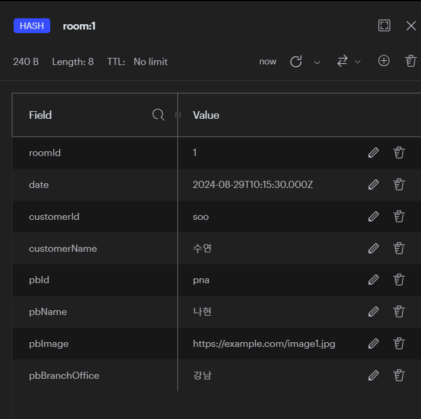
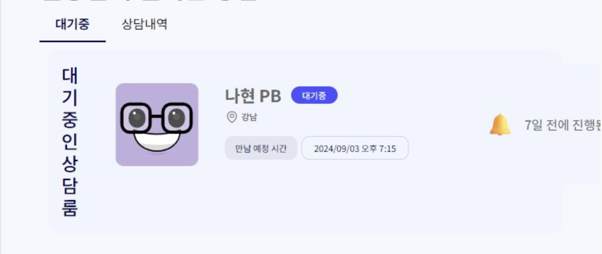
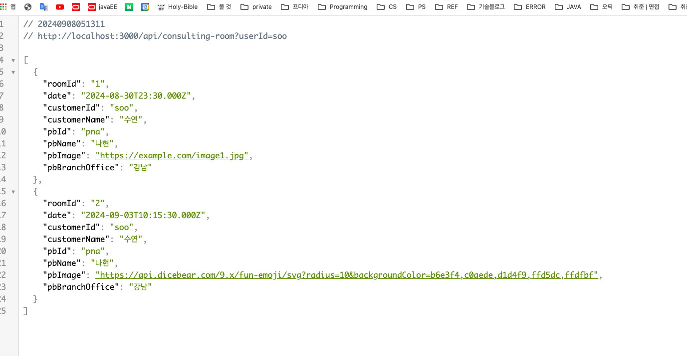
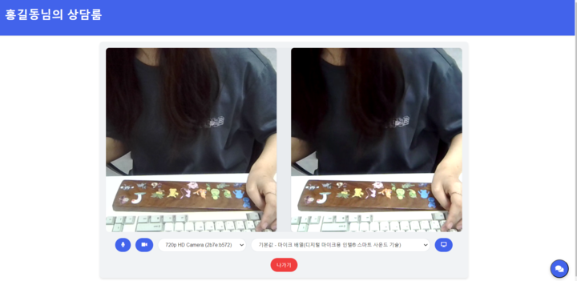
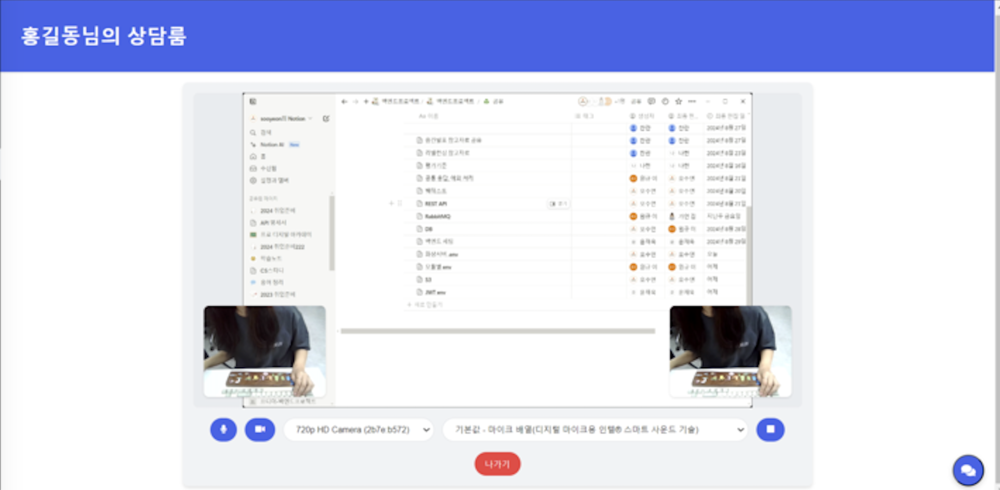
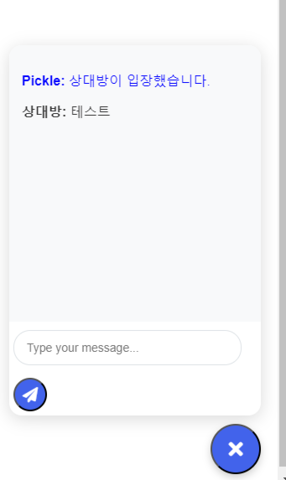

# Pickle-RealTimeConsultingServer
PizzaPickle - 고객과 PB를 연결시켜주는 화상상담서버

###  기술 스택
#### 프론트엔드

#### 백엔드

#### 실시간 통신

### 핵심 기능
- 화면 공유
- 비디오 공유
- 소리 공유
- 비디오 및 마이크 On/Off
- 비디오 및 마이크 연결 기기 선택 
- 채팅

### 주요 기능 설명 및 화면
<table>
  <tr>
    <td>
      <strong>룸 정보 리슨 & 저장</strong> 
      rabbitMQ의 특정 큐를 리슨하며, 해당 큐로 전달된 룸관련 정보를 Redis에 저장함
    </td>
    <td>
       
      
    </td>
  </tr>
  <tr>
    <td>
      <strong>룸 정보 조회</strong> 
      api를 통해 redis에 저장된 룸관련 정보를 조회하여 룸 정보를 대기룸에 보여줌 
      배포된 상태에서는, 주기적으로 상담 시작 시간으로부터 1시간이 지난 룸 정보는 지우는 함수를 실행함
    </td>
    <td>
       
      
    </td>
  </tr>
  <tr>
    <td><strong>비디오 공유</strong></td>
    <td></td>
  </tr>
  <tr>
    <td><strong>화면 공유</strong></td>
    <td></td>
  </tr>
  <tr>
    <td><strong>채팅</strong></td>
    <td></td>
  </tr>
</table>
